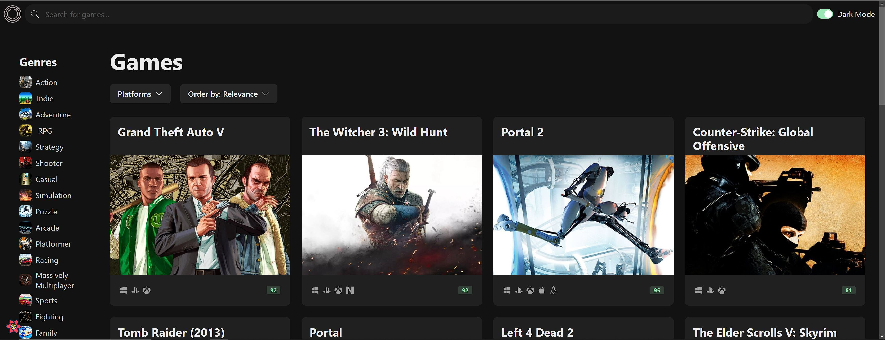
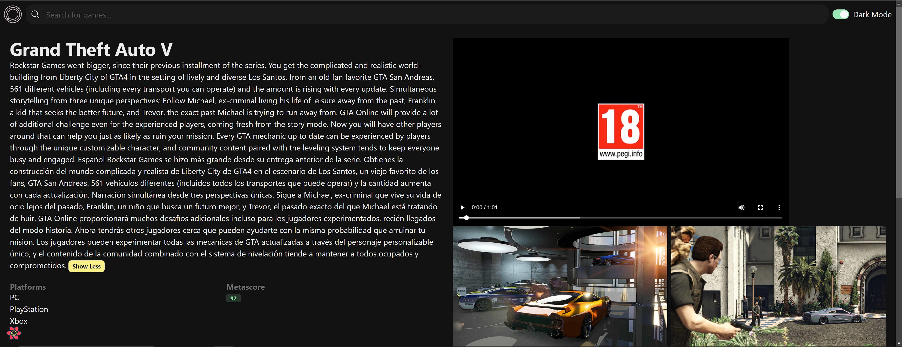
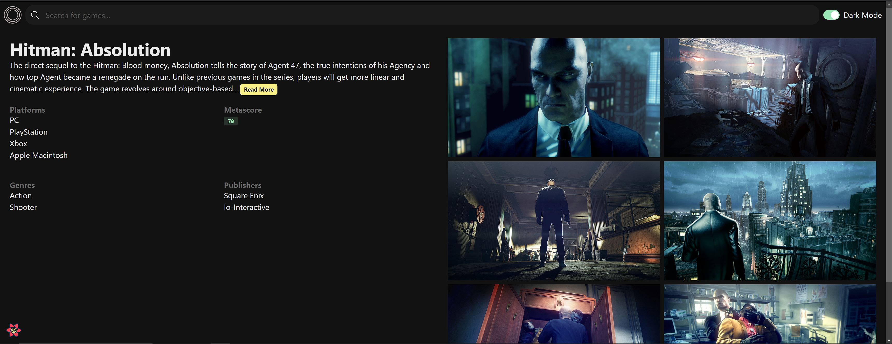
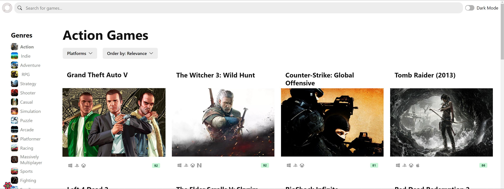
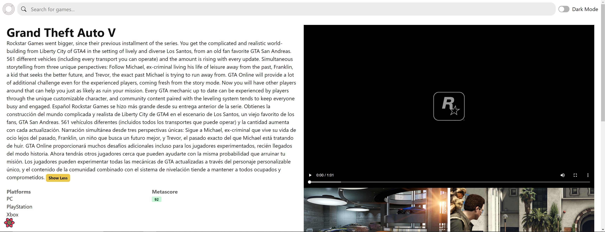
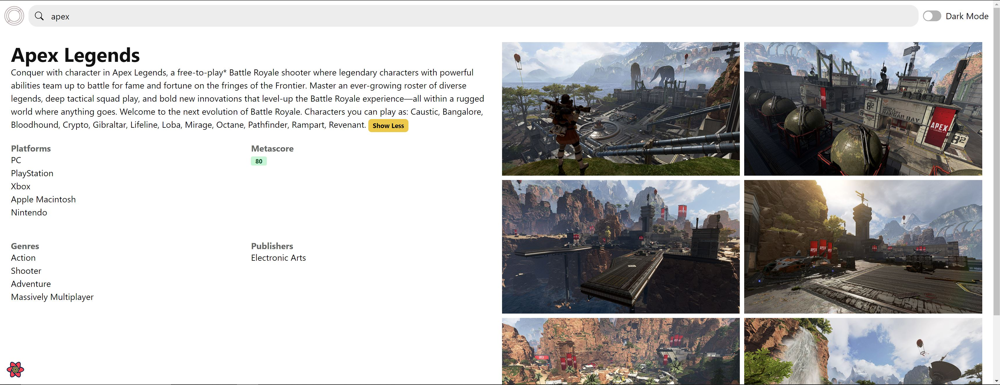

  
  <h1>GameScout</h1>
  
  

    Discover your favourite games!
  

  
  
<h4>
     · 
    <a href="https://tripguide-capstone-jsm.vercel.app/" target="blank">View Demo</a>
     · 
  </h4>

 

<!-- Table of Contents -->
# :notebook_with_decorative_cover: Table of Contents

- [:notebook\_with\_decorative\_cover: Table of Contents](#notebook_with_decorative_cover-table-of-contents)
    - [:camera: Screenshots](#camera-screenshots)
    - [:space\_invader: Tech Stack](#space_invader-tech-stack)
  - [:toolbox: Getting Started](#toolbox-getting-started)
    - [:running: Run Locally](#running-run-locally)
  - [🧞 Commands](#-commands)
  - [:warning: License](#warning-license)

<!-- Screenshots -->
### :camera: Screenshots

 
  
  
  
  
  
  
  

<!-- TechStack -->
### :space_invader: Tech Stack

  <ul>
    <li><a href="https://www.typescriptlang.org/">Typescript</a></li>
    <li><a href="https://reactjs.org/">React.js</a></li>
    <li><a href="https://chakra-ui.com/">Chakra-UI</a></li>
    <li><a href="https://zustand-demo.pmnd.rs/">Zustand</a></li>
    <li><a href="https://github.com/framer/motion">Framer Motion</li> 
  </ul>

<!-- Getting Started -->
## 	:toolbox: Getting Started

<!-- Run Locally -->
### :running: Run Locally

Clone the project

## 🧞 Commands

All commands are run from the root of the project, from a terminal:

| Command                   | Action                                           |
| :------------------------ | :----------------------------------------------- |
| `npm install`             | Installs dependencies                            |
| `npm run dev`             | Starts local dev server at `localhost:3000`      |
| `npm run build`           | Build your production site to `./dist/`          |
| `npm run preview`         | Preview your build locally, before deploying     |

<!-- License -->
## :warning: License

Copyright 2023 Abil Shrestha

Licensed under the Apache License, Version 2.0 (the "License"); you may not use this file except in compliance with the License. You may obtain a copy of the License at
http://www.apache.org/licenses/LICENSE-2.0

Unless required by applicable law or agreed to in writing, software distributed under the License is distributed on an "AS IS" BASIS, WITHOUT WARRANTIES OR CONDITIONS OF ANY KIND, either express or implied. See the License for the specific language governing permissions and limitations under the License.

